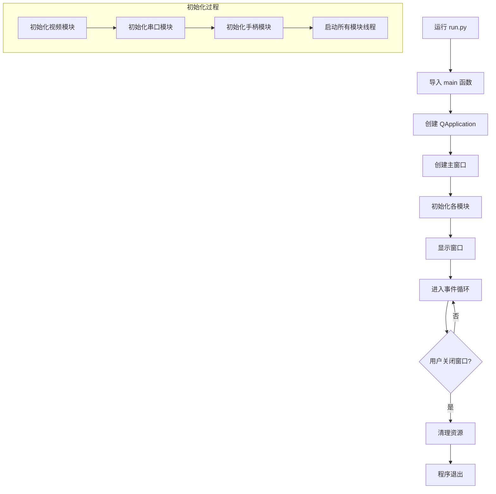
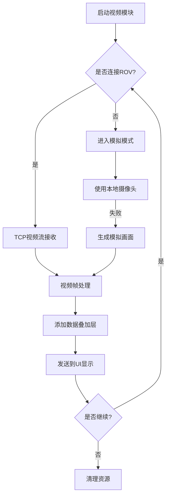
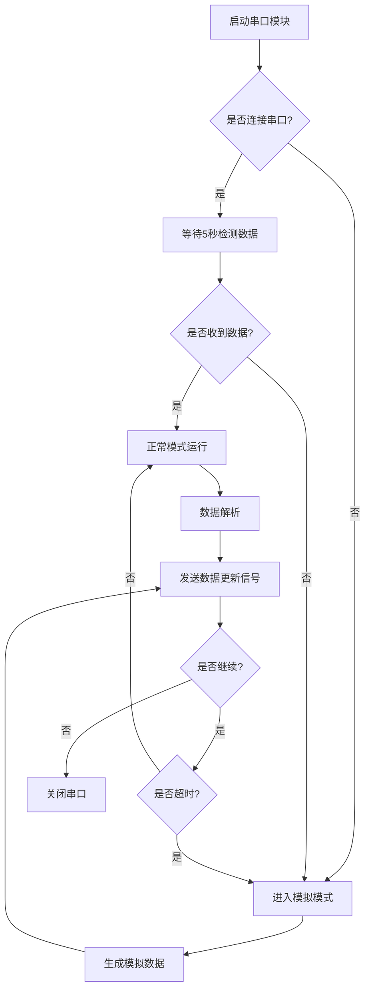
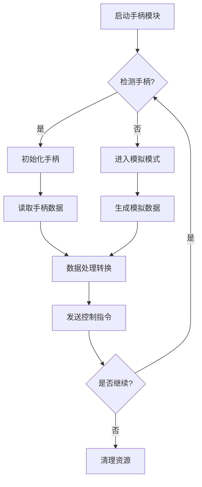
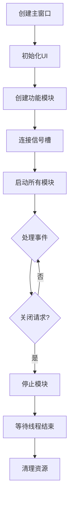

# ROV/AUV水下机器人上位机控制系统

这是一个用于控制ROV/AUV水下机器人的上位机软件系统。该系统提供实时视频显示、状态监控、数据采集以及遥控操作等功能。

## 功能特点

- 实时视频显示（支持TCP视频流）
- 数据叠加显示（深度、航向、电池电压）
- 串口通信（温度、湿度等传感器数据）
- 游戏手柄控制支持
- 模拟模式支持（用于调试）

## 系统要求

- Python 3.7+
- Windows/Linux/MacOS

## 依赖安装

```bash
pip install -r requirements.txt
```

## 运行方法

```bash
python run.py
```

## 程序运行流程

### 主程序启动流程



## 模块说明

### 1. 视频模块 (VideoModule)

视频模块负责处理视频流的接收和显示。

#### 工作流程



#### 主要功能
- TCP视频流接收
- 本地摄像头支持
- 模拟画面生成
- 数据叠加显示

### 2. 串口模块 (SerialModule)

串口模块负责与ROV进行串口通信，接收传感器数据。

#### 工作流程



#### 主要功能
- 串口设备扫描
- 数据收发
- 自动重连
- 模拟数据生成
- 智能连接检测
  - 连接后等待5秒检测数据
  - 无数据自动切换到模拟模式
  - 运行中持续监控数据状态

#### 注意事项
1. 串口连接后会自动等待5秒检测数据
2. 如果5秒内没有收到数据，会自动切换到模拟模式
3. 运行过程中如果超过5秒没有收到数据，也会切换到模拟模式
4. 模拟模式下会生成合理的测试数据

### 3. 游戏手柄模块 (GamepadModule)

游戏手柄模块负责处理手柄输入并转换为控制指令。

#### 工作流程



#### 主要功能
- 手柄设备检测
- 实时数据读取
- 控制数据转换
- 模拟数据支持

### 4. 主界面模块 (MainWindow)

主界面模块负责整合所有功能模块并提供用户界面。

#### 工作流程



#### 主要功能
- 界面布局管理
- 模块状态监控
- 用户交互处理
- 资源管理

## 注意事项

1. 首次运行前请确保已安装所有依赖
2. 使用游戏手柄时请先确保手柄已正确连接到电脑
3. 串口连接前请确认正确的串口号
4. 视频显示支持自动适应窗口大小

## 开发模式

系统支持两种运行模式：

1. 正常模式：连接实际的ROV/AUV设备
2. 模拟模式：用于开发和调试，无需实际硬件

在没有连接ROV/AUV设备时，系统会自动切换到模拟模式，生成测试数据。

## 项目结构

```
.
├── README.md
├── requirements.txt
├── run.py
└── src/
    ├── __init__.py
    ├── main.py
    ├── config/
    ├── modules/
    │   ├── __init__.py
    │   ├── video_module.py
    │   ├── serial_module.py
    │   └── gamepad_module.py
    ├── ui/
    │   ├── __init__.py
    │   └── main_window.py
    └── utils/
```

## 错误处理

每个模块都实现了完整的错误处理机制：
- 设备连接失败自动切换到模拟模式
- 数据接收异常自动重试
- 资源清理保护机制
- 优雅的退出处理 